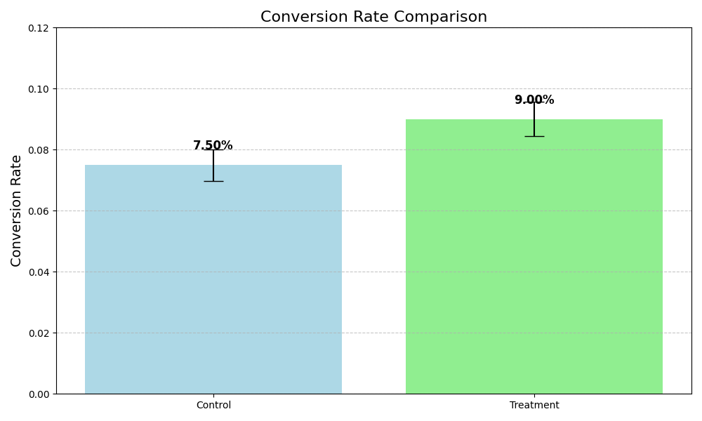

# AB-Testing-Analysis
# A/B Testing Analysis Project

Statistical analysis of e-commerce conversion test comparing two website designs

## Key Findings
- New design increased conversions by 1.5%
- Results are statistically significant (p < 0.05)
- Estimated annual revenue impact: $547,500

## Visualization


## How to Run
```bash
pip install pandas numpy matplotlib scipy
python ab_test_analysis_final.py
